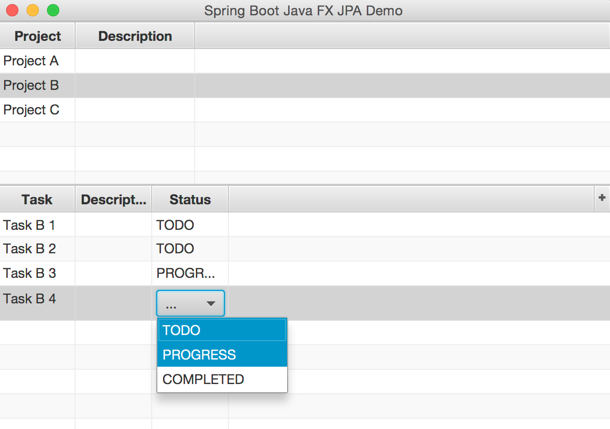

Spring Boot Java FX / JPA integration example
======================================

Prototypic example on how one could use Spring-Boot with JavaFX and JPA under Java 8. 

Run with ```mvn spring-boot:run``` 
or
Run with ```java -jar target/spring-boot-javafx-jpa-demo-0.0.1-SNAPSHOT.jar```

Note that the link between `demo.projects.ui.ProjectsPresenter` and `demo.projects.ui.ProjectsView` isestablished via `fx:controller="demo.projects.ui.ProjectsPresenter"` in the `src/main/java/demo/projects/ui/projects.fxml`


Example log:

```
  .   ____          _            __ _ _
 /\\ / ___'_ __ _ _(_)_ __  __ _ \ \ \ \
( ( )\___ | '_ | '_| | '_ \/ _` | \ \ \ \
 \\/  ___)| |_)| | | | | || (_| |  ) ) ) )
  '  |____| .__|_| |_|_| |_\__, | / / / /
 =========|_|==============|___/=/_/_/_/
 :: Spring Boot ::        (v1.2.3.RELEASE)

2015-04-15 14:38:57.942  INFO 82863 --- [lication Thread] o.s.boot.SpringApplication               : Starting application on gauss with PID 82863 (started by tom in /Users/tom/Documents/dev/ws/sts364-spring/spring-boot-javafx-jpa-demo)
2015-04-15 14:38:57.993  INFO 82863 --- [lication Thread] s.c.a.AnnotationConfigApplicationContext : Refreshing org.springframework.context.annotation.AnnotationConfigApplicationContext@ba6b1b5: startup date [Wed Apr 15 14:38:57 CEST 2015]; root of context hierarchy
2015-04-15 14:38:59.148  INFO 82863 --- [lication Thread] j.LocalContainerEntityManagerFactoryBean : Building JPA container EntityManagerFactory for persistence unit 'default'
2015-04-15 14:38:59.168  INFO 82863 --- [lication Thread] o.hibernate.jpa.internal.util.LogHelper  : HHH000204: Processing PersistenceUnitInfo [
	name: default
	...]
2015-04-15 14:38:59.231  INFO 82863 --- [lication Thread] org.hibernate.Version                    : HHH000412: Hibernate Core {4.3.8.Final}
2015-04-15 14:38:59.234  INFO 82863 --- [lication Thread] org.hibernate.cfg.Environment            : HHH000206: hibernate.properties not found
2015-04-15 14:38:59.236  INFO 82863 --- [lication Thread] org.hibernate.cfg.Environment            : HHH000021: Bytecode provider name : javassist
2015-04-15 14:38:59.426  INFO 82863 --- [lication Thread] o.hibernate.annotations.common.Version   : HCANN000001: Hibernate Commons Annotations {4.0.5.Final}
2015-04-15 14:38:59.752  INFO 82863 --- [lication Thread] org.hibernate.dialect.Dialect            : HHH000400: Using dialect: org.hibernate.dialect.H2Dialect
2015-04-15 14:38:59.917  INFO 82863 --- [lication Thread] o.h.h.i.ast.ASTQueryTranslatorFactory    : HHH000397: Using ASTQueryTranslatorFactory
2015-04-15 14:39:00.240  INFO 82863 --- [lication Thread] org.hibernate.tool.hbm2ddl.SchemaExport  : HHH000227: Running hbm2ddl schema export
Hibernate: drop table project if exists
Hibernate: drop table task if exists
Hibernate: create table project (id bigint generated by default as identity, description varchar(255), name varchar(255), primary key (id))
Hibernate: create table task (id bigint generated by default as identity, description varchar(255), name varchar(255), status varchar(255), project_id bigint, primary key (id))
Hibernate: alter table task add constraint FK_b7i81l1tk1ph95xnhtoftyv53 foreign key (project_id) references project
2015-04-15 14:39:00.272  INFO 82863 --- [lication Thread] org.hibernate.tool.hbm2ddl.SchemaExport  : HHH000230: Schema export complete
2015-04-15 14:39:00.435  INFO 82863 --- [lication Thread] o.s.jdbc.datasource.init.ScriptUtils     : Executing SQL script from URL [jar:file:/Users/tom/Documents/dev/ws/sts364-spring/spring-boot-javafx-jpa-demo/target/spring-boot-javafx-jpa-demo-0.0.1-SNAPSHOT.jar!/data.sql]
2015-04-15 14:39:00.445  INFO 82863 --- [lication Thread] o.s.jdbc.datasource.init.ScriptUtils     : Executed SQL script from URL [jar:file:/Users/tom/Documents/dev/ws/sts364-spring/spring-boot-javafx-jpa-demo/target/spring-boot-javafx-jpa-demo-0.0.1-SNAPSHOT.jar!/data.sql] in 10 ms.
2015-04-15 14:39:00.852  INFO 82863 --- [lication Thread] o.s.boot.SpringApplication               : Started application in 3.195 seconds (JVM running for 3.905)
Hibernate: select project0_.id as id1_0_, project0_.description as descript2_0_, project0_.name as name3_0_ from project project0_
Hibernate: select task0_.id as id1_1_, task0_.description as descript2_1_, task0_.name as name3_1_, task0_.project_id as project_5_1_, task0_.status as status4_1_ from task task0_ left outer join project project1_ on task0_.project_id=project1_.id where project1_.id=?
Hibernate: select project0_.id as id1_0_0_, project0_.description as descript2_0_0_, project0_.name as name3_0_0_ from project project0_ where project0_.id=?
Hibernate: select task0_.id as id1_1_, task0_.description as descript2_1_, task0_.name as name3_1_, task0_.project_id as project_5_1_, task0_.status as status4_1_ from task task0_ left outer join project project1_ on task0_.project_id=project1_.id where project1_.id=?
Hibernate: select project0_.id as id1_0_0_, project0_.description as descript2_0_0_, project0_.name as name3_0_0_ from project project0_ where project0_.id=?
Hibernate: select task0_.id as id1_1_0_, task0_.description as descript2_1_0_, task0_.name as name3_1_0_, task0_.project_id as project_5_1_0_, task0_.status as status4_1_0_ from task task0_ where task0_.id=?
Hibernate: select project0_.id as id1_0_0_, project0_.description as descript2_0_0_, project0_.name as name3_0_0_ from project project0_ where project0_.id=?
Hibernate: update task set description=?, name=?, project_id=?, status=? where id=?
Hibernate: select task0_.id as id1_1_, task0_.description as descript2_1_, task0_.name as name3_1_, task0_.project_id as project_5_1_, task0_.status as status4_1_ from task task0_ left outer join project project1_ on task0_.project_id=project1_.id where project1_.id=?
Hibernate: select project0_.id as id1_0_0_, project0_.description as descript2_0_0_, project0_.name as name3_0_0_ from project project0_ where project0_.id=?
Hibernate: select task0_.id as id1_1_, task0_.description as descript2_1_, task0_.name as name3_1_, task0_.project_id as project_5_1_, task0_.status as status4_1_ from task task0_ left outer join project project1_ on task0_.project_id=project1_.id where project1_.id=?
Hibernate: select project0_.id as id1_0_0_, project0_.description as descript2_0_0_, project0_.name as name3_0_0_ from project project0_ where project0_.id=?
2015-04-15 14:39:12.773  INFO 82863 --- [lication Thread] s.c.a.AnnotationConfigApplicationContext : Closing org.springframework.context.annotation.AnnotationConfigApplicationContext@ba6b1b5: startup date [Wed Apr 15 14:38:57 CEST 2015]; root of context hierarchy
2015-04-15 14:39:12.775  INFO 82863 --- [lication Thread] j.LocalContainerEntityManagerFactoryBean : Closing JPA EntityManagerFactory for persistence unit 'default'
```

