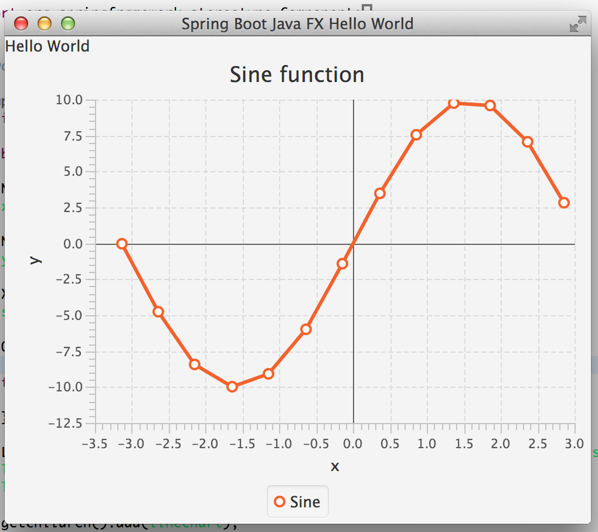

Spring Boot Java FX integration example
======================================

Prototypic example on how one could use Spring-Boot with JavaFX under Java 8. 

Run with ```mvn spring-boot:run``` 
or
Run with ```java -jar target/spring-boot-javafx-demo.jar```

```
  .   ____          _            __ _ _
 /\\ / ___'_ __ _ _(_)_ __  __ _ \ \ \ \
( ( )\___ | '_ | '_| | '_ \/ _` | \ \ \ \
 \\/  ___)| |_)| | | | | || (_| |  ) ) ) )
  '  |____| .__|_| |_|_| |_\__, | / / / /
 =========|_|==============|___/=/_/_/_/
 :: Spring Boot ::        (v1.1.8.RELEASE)

2014-11-12 20:37:21.476  INFO 99717 --- [lication Thread] o.s.boot.SpringApplication               : Starting application on gauss with PID 99717 (started by tom in /Users/tom/Documents/dev/repos/thomasdarimont/spring-labs/spring-boot-javafx)
2014-11-12 20:37:21.515  INFO 99717 --- [lication Thread] s.c.a.AnnotationConfigApplicationContext : Refreshing org.springframework.context.annotation.AnnotationConfigApplicationContext@7e07bc8e: startup date [Wed Nov 12 20:37:21 CET 2014]; root of context hierarchy
2014-11-12 20:37:22.493  INFO 99717 --- [lication Thread] o.s.j.e.a.AnnotationMBeanExporter        : Registering beans for JMX exposure on startup
2014-11-12 20:37:22.508  INFO 99717 --- [lication Thread] o.s.boot.SpringApplication               : Started application in 1.383 seconds (JVM running for 2.023)
2014-11-12 20:37:28.092  INFO 99717 --- [       Thread-7] s.c.a.AnnotationConfigApplicationContext : Closing org.springframework.context.annotation.AnnotationConfigApplicationContext@7e07bc8e: startup date [Wed Nov 12 20:37:21 CET 2014]; root of context hierarchy
2014-11-12 20:37:28.093  INFO 99717 --- [       Thread-7] o.s.j.e.a.AnnotationMBeanExporter        : Unregistering JMX-exposed beans on shutdown
```

