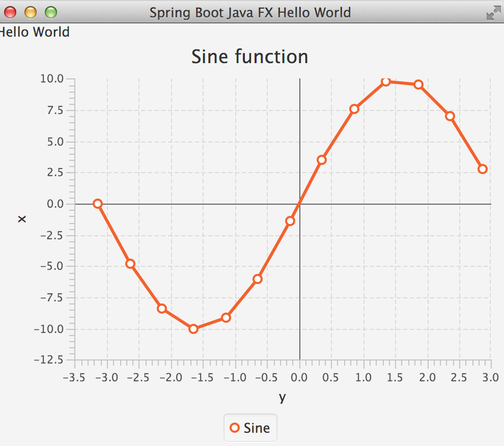

Spring Boot Java FX integration example
======================================

This example application demonstrates how to use Spring-Boot with JavaFX under Java 8. 

Run with ```mvn spring-boot:run```

```
  .   ____          _            __ _ _
 /\\ / ___'_ __ _ _(_)_ __  __ _ \ \ \ \
( ( )\___ | '_ | '_| | '_ \/ _` | \ \ \ \
 \\/  ___)| |_)| | | | | || (_| |  ) ) ) )
  '  |____| .__|_| |_|_| |_\__, | / / / /
 =========|_|==============|___/=/_/_/_/
 :: Spring Boot ::        (v1.1.4.RELEASE)

2014-08-08 11:39:42.061  INFO 65984 --- [           main] demo.App                                 : Starting App on gauss.fritz.box with PID 65984 (/Users/tom/Documents/dev/repos/thomasdarimont/spring-labs/spring-boot-javafx/target/classes started by tom in /Users/tom/Documents/dev/repos/thomasdarimont/spring-labs/spring-boot-javafx)
2014-08-08 11:39:42.092  INFO 65984 --- [           main] s.c.a.AnnotationConfigApplicationContext : Refreshing org.springframework.context.annotation.AnnotationConfigApplicationContext@6ee12bac: startup date [Fri Aug 08 11:39:42 CEST 2014]; root of context hierarchy
2014-08-08 11:39:45.765  INFO 65984 --- [           main] o.s.j.e.a.AnnotationMBeanExporter        : Registering beans for JMX exposure on startup
2014-08-08 11:39:45.778  INFO 65984 --- [           main] demo.App                                 : Started App in 4.042 seconds (JVM running for 4.697)
2014-08-08 11:39:45.779  INFO 65984 --- [       Thread-5] s.c.a.AnnotationConfigApplicationContext : Closing org.springframework.context.annotation.AnnotationConfigApplicationContext@6ee12bac: startup date [Fri Aug 08 11:39:42 CEST 2014]; root of context hierarchy
2014-08-08 11:39:45.779  INFO 65984 --- [       Thread-5] o.s.j.e.a.AnnotationMBeanExporter        : Unregistering JMX-exposed beans on shutdown
```
